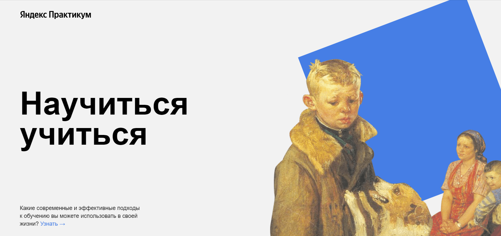

# __Научиться учиться__
-----

*Вторая проектная работа на курсе по веб-разработке от [Яндекс-практикума](https://practicum.yandex.ru/ "Перейти на сайт практикума")*  
Проект одностраничного сайта, реализованный с помощью HTML и CSS.  
## __Что изменилось__  
Для выполнения задания использовались наработки первой проектной работы, а так же:  
* на сайте появилось несколько новых секций, в том числе секция со встроенным при помощи
```html
<iframe>
```
видео  
* добавились анимации  
* была создана файловая структура CSS по методологоии БЭМ (Neasted)  
---  
## __Связаться со мной__
sashakostiukova@yandex.ru